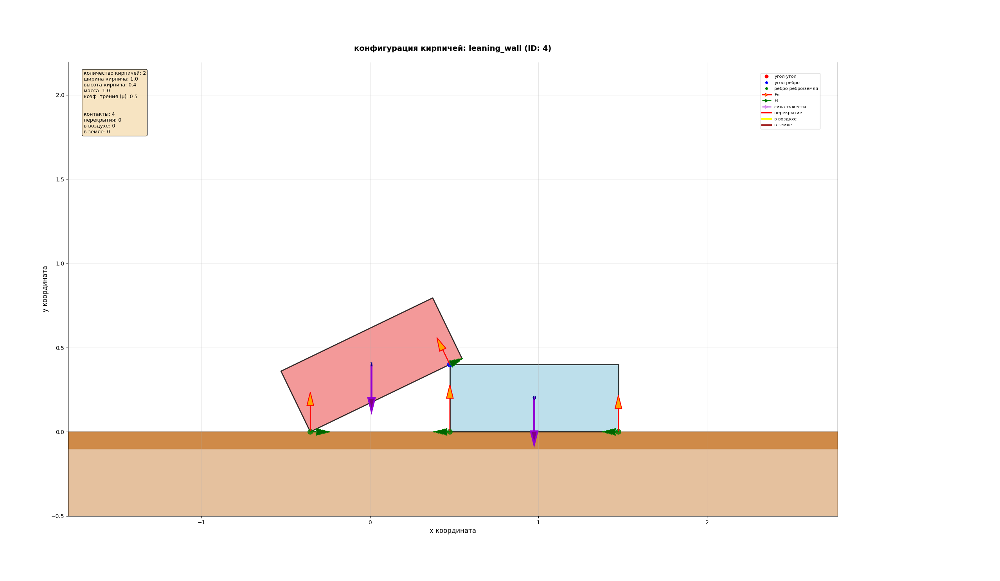
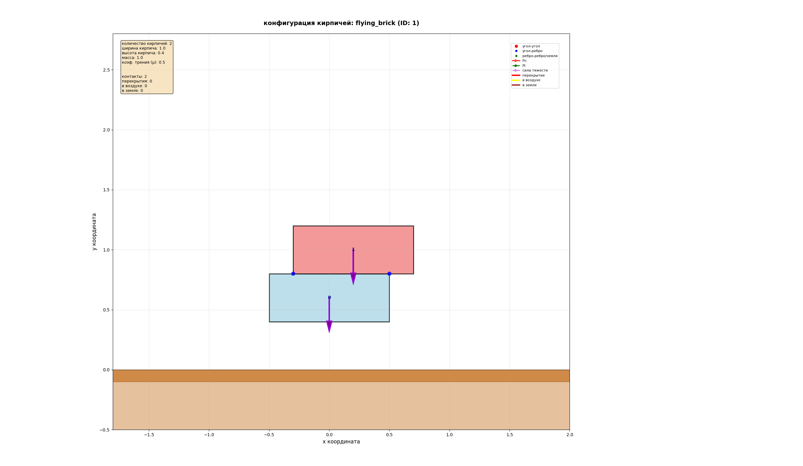
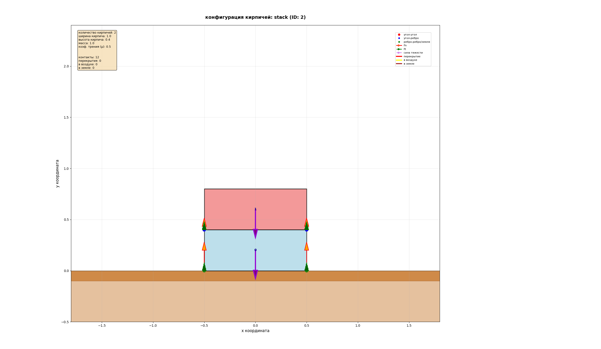
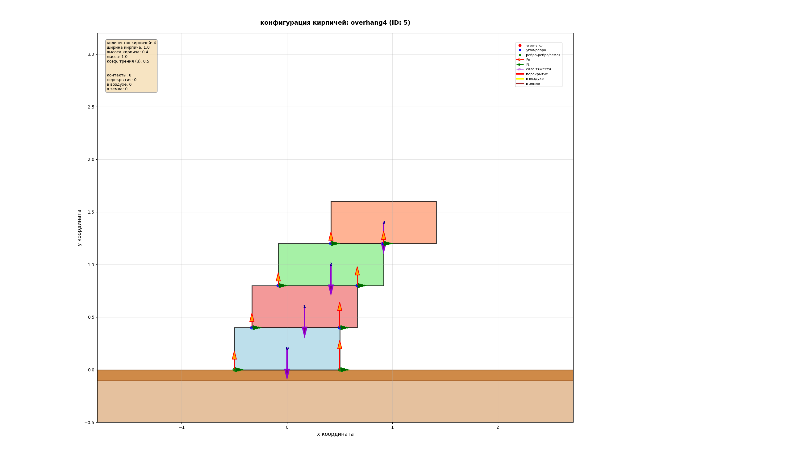

# Mountain of Bricks — статическое равновесие горы кирпичей

Учебный проект по вычислению статического равновесия системы прямоугольных кирпичей с трением и визуализацией результатов.

Проект умеет:

* загружать сцену из JSON (расположение, размеры и масса кирпичей);
* находить контакты кирпич-кирпич и кирпич-земля;
* формулировать и решать задачу на статическое равновесие в виде квадратичной оптимизации (QP);
* решать её двумя разными солверами: готовым QP-солвером (cvxopt) и самописным проекционным градиентным методом;
* визуализировать кирпичи, контакты и силовые векторы.

---

## Структура проекта

```text
project_root/
  main.py              # Точка входа: загрузка сцены, запуск анализа и визуализации
  src/
    load_config.py     # Загрузка конфигурации из JSON в BrickConfig
    contact_finder.py  # Поиск контактов, перекрытий, "летающих" кирпичей и т.п.
    system_solver.py   # Постановка задачи равновесия и вызов QP-солверов
    GPM_qp_solver.py   # Самописный солвер мягкого равновесия (projected gradient)
    visualization.py   # Визуализация кирпичей, контактов и сил
    creatorjson.py     # Генерация примерных сцен и сохранение их в JSON
  scenes/              # Примеры конфигураций (stack.json, leaning_wall.json, ...)
  results/             # Сюда можно складывать скриншоты визуализации
```

Ключевые сущности:

* `BrickConfig` — параметры сцены: размеры и масса кирпичей, гравитация, коэффициент трения, позиции кирпичей.
* `Contact` / `ContactPoint` — контакты между кирпичами и с землёй, плюс диагностическая информация (перекрытия, подземные кирпичи, летающие кирпичи).
* `QPSolution` — результат работы солвера: вектор контактных сил, статус, значение функционала и ошибка равновесия.

---

## Установка и зависимости

Рекомендуемое окружение: Python 3.10+.

Минимальные зависимости:

* `numpy`
* `matplotlib`

Для использования готового QP-солвера cvxopt (опционально):

* `cvxopt`

Пример установки (через venv):

```bash
python -m venv algvenv
source algvenv/bin/activate   # Linux/macOS
# .\algvenv\Scripts\activate  # Windows (PowerShell)

pip install numpy matplotlib cvxopt
```

Если cvxopt не нужен (используем только самописный солвер), можно не ставить `cvxopt`.

---

## Запуск проекта

Базовый запуск на примере сцены `stack.json`:

```bash
python main.py scenes/stack.json
```

При запуске:

1. `main.py` загружает JSON в `BrickConfig`;
2. `contact_finder` строит контакты, проверяет перекрытия и "летающие" кирпичи;
3. `system_solver` формулирует задачу равновесия и вызывает выбранный QP-солвер;
4. `visualization` рисует кирпичи, контакты и силовые векторы.

Если вы запускаете под X11/Wayland и хотите видеть окно matplotlib, убедитесь, что выбран интерактивный backend, например:

```bash
MPLBACKEND=TkAgg python main.py scenes/stack.json
```

(для этого должен быть установлен `python3-tk` в системе).

---

## Переключение солверов (самописный vs cvxopt)

Выбор солвера управляется флагом в `src/system_solver.py`:

```python
# Если True — используем самописный солвер мягкого равновесия (GPM_qp_solver).
# Если False — используем готовый QP-решатель cvxopt.solvers.qp.
USE_MANUAL_SOLVER: bool = True
```

* `USE_MANUAL_SOLVER = True` — используется самописный проекционный градиент
  (`solve_soft_qp_equilibrium` из `GPM_qp_solver.py`).
* `USE_MANUAL_SOLVER = False` — используется классический QP-солвер из `cvxopt.solvers.qp`.

Для самописного солвера отдельно настроены параметры точности и сходимости:

```python
MANUAL_TOL_GRAD: float = 1e-4      # порог по норме градиента
MANUAL_TOL_EQ: float   = 1e-2      # порог по ||J^T λ + Q|| (ошибка равновесия)
MANUAL_MAX_ITERS: int  = 5000      # максимум итераций
MANUAL_EPSILON_REG: float = 1e-4   # регуляризация ε

# Порог, при котором max_iters трактуется как «примерно стабильно» для визуализации:
MANUAL_APPROX_VIS_TOL: float = 1e1
```

Это позволяет сравнивать поведение двух солверов на одних и тех же сценах, меняя только один флаг.

---

## Как это работает (коротко)

1. **Контакты**. `contact_finder.py` по положениям кирпичей находит:

   * контакты кирпич-земля;
   * контакты кирпич-кирпич (угол-ребро, ребро-ребро);
   * перекрытия и подземные кирпичи (фатальные ошибки для QP);
   * "летающие" кирпичи (предупреждение).

2. **Матричная формулировка**.

   * Строится матрица контактов `J_T = J^T` размера `(3·N_bricks) × (2·N_contacts)`;
   * Строится вектор внешних сил `Q` (гравитация);
   * Вектор неизвестных `λ` содержит нормальные и тангенциальные силы контактов.

3. **QP-задача**.

   * Строгий вариант: равновесие `J^T λ + Q = 0`, плюс конус трения `λ_N ≥ 0`, `|λ_T| ≤ μ λ_N`;
   * Мягкий вариант (для проекционного градиента): минимум
     `½ ||J^T λ + Q||² + (ε/2)||λ||²` при `λ` в конусе трения.

4. **Солверы**.

   * `cvxopt` решает классическую QP-задачу с равенствами и неравенствами;
   * `GPM_qp_solver` делает итерационный шаг градиентного спуска и проецирует решение на конус трения по каждому контакту.

5. **Анализ устойчивости**.

   * По статусу солвера и ошибке равновесия выставляется метка: `STABLE`, `APPROX_STABLE_MAX_ITERS`, `UNSTABLE_*` и т.д.;
   * По каждому контакту считается отношение трения `|λ_T|/(μ λ_N)` и фиксируются возможные нарушения (слишком близко к 1, выход за пределы трения, растяжение).

6. **Визуализация**.

   * Кирпичи рисуются как повернутые прямоугольники;
   * Контакты — точками;
   * Силы — стрелками (гравитация и контактные силы), c динамическим масштабом.

---

## Демонстрация результатов

Ниже — места для вставки скриншотов результатов работы программы.
Предполагается, что вы сохраните изображения в папку `results/` и вставите сюда ссылки.

### 1. Стенка под углом — `leaning_wall.json`

(Здесь будет картинка с визуализацией сцены `leaning_wall.json`)

Пример вставки позже:

```markdown

*Конфигурация: leaning_wall.json*
```

---

### 2. Летающий кирпич — `flying_brick.json`

(Здесь будет картинка с визуализацией сцены `flying_brick.json`)

Пример вставки позже:

```markdown

*Конфигурация: flying_brick.json*
```

---

### 3. Стопка кирпичей — `stack.json`

(Здесь будет картинка с визуализацией сцены `stack.json`)

Пример вставки позже:

```markdown

*Конфигурация: stack.json*
```

---

### 4. Большой вынос — `overhang4.json`

(Здесь будет картинка с визуализацией сцены `overhang4.json`)

Пример вставки позже:

```markdown

*Конфигурация: overhang4.json*
```

